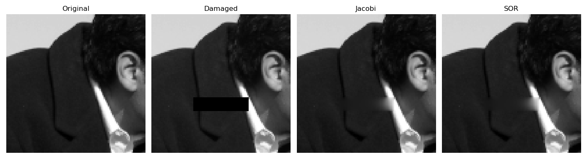

# Image Inpainting with Jacobi and SOR

## Overview
This Python project implements **image inpainting** to restore missing regions in grayscale images using the **Jacobi** and **Successive Overrelaxation (SOR)** methods. Developed for the Numerical Linear Algebra course (Summer 2025, BTU Cottbus-Senftenberg, Germany).

## Key Features
- **Inpainting**: Solves the 2D Laplace equation with a 5-point stencil to reconstruct damaged image regions.
- **Numerical Solvers**: Implements Jacobi and SOR, with an optimized ω for SOR based on spectral radius.
- **Tech Stack**: Uses **NumPy** for efficient matrix operations and **Matplotlib** for visualization.
- **Robust Code**: Modular, tested code with input validation, passing automated tests in a virtual lab.

## Skills Demonstrated
- **Image Processing/Computer Vision**: Applied PDE-based inpainting for image restoration.
- **Numerical Methods**: iterative solvers for the Laplace equation.
- **Python**: NumPy and Matplotlib for data processing and visualization.
- **Optimization**: Computed optimal SOR parameters for faster convergence.

## Output

## How to Run
1. **Requirements**: Python 3.x, NumPy, Matplotlib.
2. **Setup**: Clone the repo and ensure `image.txt` is in the root directory.
3. **Run**: `python iterative_solver.py` to inpaint and visualize results.

---
*_This project was completed as part of the Numerical Linear Algebra course at Brandenburgische Technische Universität._
